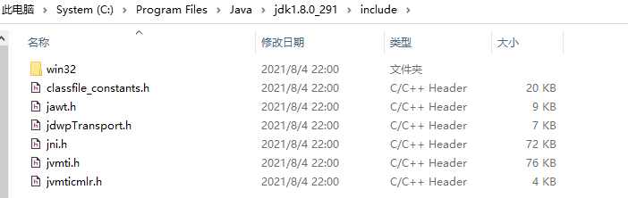

#### 1 JNI

JNI，全名 Java Native Interface，是Java本地接口，JNI是Java调用Native 语言的一种特性，通过JNI可以使得Java与C/C++机型交互。简单点说就是JNI是Java中调用C/C++的统称。

- Java程序中的函数可以调用Native语言写的函数，Native一般指的是C/C++编写的函数。
- Native程序中的函数可以调用Java层的函数，也就是在C/C++程序中可以调用Java的函数。


##### 1.1 JNI使用

###### 1.1.1 声明Native方法

```java
package TestJNI;
// 带包名

public class JNICallCpp {
	// 声明为native，表明是有外部来实现的
	public native void HannoTower(int topN, char from, char inter, char to);
	public native void HellCpp();

}
```

###### 1.1.2 编译生成头文件

- 带包名编译

如果`.java`文件中带有包名，则编译时需要切换到`包文件所在同级目录`，适用命令`javah 包名.类名`。如，在E:\JavaProject\LearnJava\src目录下，打开cmd，输入
javah TestJNI.JNICallCpp。

```shell
E:
cd E:\JavaProject\LearnJava\src
javah TestJNI.JNICallCpp
```

- 不带包名编译

如果`.java`文件中没有包名，则编译时需要切换到`.java文件所在同级目录`，适用命令`javah 类名`。如，在E:\JavaProject\LearnJava\src\TestJNI\目录下，打开cmd，输入javah JNICallCpp。

```shell
E:
cd E:\JavaProject\LearnJava\src\TestJNI\
javah JNICallCpp
```

###### 1.1.3 实现Native方法

将编译生成的头文件引入C++工程的头文件中，以及`jni.h、jni_md.h`并在新建源文件实现头文件中定义的JNI格式的的函数，由于JNI的数据类型与C++数据类型并不完全相同，因此需要进行数据类型转换，实现定义的函数后，编译为`dll、so`格式库文件，该文件中即包含该接口。

- `jni.h`：C:\\Program Files\\Java\\jdk1.8.0_291\\include\\jni.h
- `jni_md.h`：C:\\Program Files\\Java\\jdk1.8.0_291\\include\\win32\\jni_md

```c++
/* DO NOT EDIT THIS FILE - it is machine generated */
#include <jni.h>
/* Header for class TestJNI_JNICallCpp */

#ifndef _Included_TestJNI_JNICallCpp
#define _Included_TestJNI_JNICallCpp
#ifdef __cplusplus
extern "C" {
#endif
/*
 * Class:     TestJNI_JNICallCpp
 * Method:    HannoTower
 * Signature: (ICCC)V
 */
JNIEXPORT void JNICALL Java_TestJNI_JNICallCpp_HannoTower
  (JNIEnv *, jobject, jint, jchar, jchar, jchar);

/*
 * Class:     TestJNI_JNICallCpp
 * Method:    HellCpp
 * Signature: ()V
 */
JNIEXPORT void JNICALL Java_TestJNI_JNICallCpp_HellCpp
  (JNIEnv *, jobject);

#ifdef __cplusplus
}
#endif
#endif

```




```c++
#include "TestJNI_JNICallCpp.h"
#include<string>
#include<iostream>
//using namespace std;

#ifdef __cplusplus
extern "C" {
#endif

	JNIEXPORT void JNICALL Java_TestJNI_JNICallCpp_HannoTower
	(JNIEnv *jni_env, jobject jobj, jint layer, jchar from, jchar inter, jchar to) {
		if (layer == 1) {
			//从Java传过来的参数jchar为unsigned int 16,不是char类型，需要强转
			std::cout << "Disk 1 from " << char(from) << " to " << char(to) << std::endl;
		}
		else {
			Java_TestJNI_JNICallCpp_HannoTower(jni_env, jobj, layer - 1, from, to, inter);
			std::cout << "Disk " << layer << " from " << char(from) << " to " << char(to) << std::endl;
			Java_TestJNI_JNICallCpp_HannoTower(jni_env, jobj, layer - 1, inter, from, to);
		}
	}

	JNIEXPORT void JNICALL Java_TestJNI_JNICallCpp_HellCpp
	(JNIEnv *, jobject) {
		std::cout << "Call Invoke JNI Func Success" << std::endl;
	}

#ifdef __cplusplus
}
#endif
```

###### 1.1.4 调用C/C++函数

```java
import java.nio.file.FileSystems;

public class CallJNIFunc {
	//	一般在类的静态（static）代码块中加载动态库最合适，因为在创建类的实例时，类会被 ClassLoader 先加载到虚拟机，
	//	随后立马调用类的 static 静态代码块。这时再去调用 native 方法就万无一失了。加载动态库的两种方式：
	//	System.loadLibrary("HelloWorld");  
	//	System.load("/Users/yangxin/Desktop/libHelloWorld.jnilib"); 
	//	Can't load IA 32-bit .dll on a AMD 64-bit platform解决
	//	64位JVM不能调用32位动态库
	static {
	//	获取当前系统分隔符路径
		String separator = FileSystems.getDefault().getSeparator();
		String path = System.getProperty("user.dir");
		System.out.println(separator);
		if (separator == "\\") {
			path += "\\CLibs\\InvokeJNIFunc.dll";
		}
		else {
			path += "/CLibs/InvokeJNIFunc.dll";
		}
		System.out.println(path);
		System.load(path);
	}
	public static void main(String[] args) {
		// TODO Auto-generated method stub
		// String path = System.getProperty("java.library.path");
		
		JNICallCpp jniCallCpp = new JNICallCpp();
		jniCallCpp.HellCpp();
		jniCallCpp.HannoTower(5, 'A', 'B', 'C');
	}
}
```

##### 1.2 JNI头文件介绍

###### 1.2.1 JNIEnv 类型和jobject类型

在上面的`TestJNI_JNICallCpp.cpp`文件中，`Java_TestJNI_JNICallCpp_HannoTower`方法中有两个参数，分别是`JNIEnv *env`,一个是`jobjet jobj`。下面简单介绍下这两个类型的作用。

###### 1.2.1.1 JNIEnv 类型

**JNIEnv**类型实际上代表了Java环境，通过JNIEnv*指针就可以对**Java端的代码**进行操作。比如可以使用JNIEnv来创建Java类中的对象，调用Java对象的方法，获取Java对象中的属性等。JNIEnv类中有很多函数可以用，如下所示:

- NewObject: 创建Java类中的对象。
- NewString: 创建Java类中的String对象。
- NewArray: 创建类型为Type的数组对象。
- GetField: 获取类型为Type的字段。
- SetField: 设置类型为Type的字段的值。
- GetStaticField: 获取类型为Type的static的字段。
- SetStaticField: 设置类型为Type的static的字段的值。
- CallMethod: 调用返回类型为Type的方法。
- CallStaticMethod: 调用返回值类型为Type的static 方法。

```c++
// 如，要调用Java中的Date类的getTime方法
// FindClass方法参数name是某个类的完整路径
(JNIEnv *env, jobject instance){
	jclass  class_date = env->FindClass("java/util/Date");
	//注意这里路径要换成/,不然会报illegal class name
	jmethodID  a_method = env->GetMethodID(class_date,"<init>","()V");
	jobject  a_date_obj = env->NewObject(class_date,a_method);
	jmethodID  date_get_time = env->GetMethodID(class_date,"getTime","()J");
	jlong get_time = env->CallLongMethod(a_date_obj,date_get_time);
	return get_time; 
}
```

###### 1.2.1.1 Jobject 类型

**Jobject**可以看做是java中的类实例的引用。当然，情况不同，意义也不一样。如果native方法不是static, jobjet 就代表native方法的类实例。如果native方法是static, jobjet 就代表native方法的类的class 对象实例(static 方法不需要类实例的，所以就代表这个类的class对象)。

- jclass GetObjectClass(jobject obj) 根据一个对象，获取该对象的类
- jclass GetSuperClass(jclass obj) 获取一个传入的对象获取他的父类的jclass
- GetMethodID: 获取非静态方法的ID
- GetStaticMethodID: 获取静态方法的ID

```c++
// 根据jobject的类型，在JNI中写方法的时候如果是非静态的都会传一个jobject的对象
// 可以根据传入的来获取当前对象的类

(JNIEnv *env, jobject instance) {
	jclass  a_class = env->GetObjectClass(instance);
    //这里的a_class就是通过instance获取到的
	……
}
```

###### 1.2.1.1 C++调用Java方法

```C++
(JNIEnv *env, jclass type) {
	jmethodID  a_method = env->GetMethodID(type,"describe","()Ljava/lang/String;"); 
    // 通过GetMethod方法获取方法的methodId.
	jobject jobj = env->AllocObject(type);                                          
    // 对jclass进行实例，相当于java中的new
	jstring pring= (jstring)(env)->CallObjectMethod(jobj,a_method);                
    // 类调用类中的方法
	char *print=(char*)(env)->GetStringUTFChars(pring,0);                           
    // 转换格式输出。
	return env->NewStringUTF(print);
}
```

##### 1.3 JNI数据类型映射

- 基本的数据类型

| Java类型 | Native类型 | 域描述符 |
| -------- | ---------- | -------- |
| boolean  | jboolean   | Z        |
| byte     | jbyte      | B        |
| char     | jchar      | C        |
| short    | jshort     | S        |
| int      | jnit       | I        |
| long     | jlong      | J        |
| float    | jfloat     | F        |
| double   | jdouble    | D        |
| void     | void       | V        |

- 数组引用类型

如果是一维数组则遵循下表，如果是二维数组或更高维数组则对应的 Natvie类型为 jobjectArray，域描述符中使用 ‘[’ 的个数表示维数：

| Java类型  | Native类型    | 域描述符 |
| --------- | ------------- | -------- |
| int[]     | jintArray     | [I       |
| float[]   | jfloatArray   | [f       |
| byte[]    | jbyteArray    | [B       |
| char[]    | jcharArray    | [C       |
| short[]   | jshortArray   | [S       |
| double[]  | jdoubleArray  | [D       |
| long[]    | jlongArray    | [F       |
| boolean[] | jbooleanArray | [Z       |

-  对象引用类型

对于其它引用类型，即 java 中的对象，其映射规则为：

| Java类型           | Native类型                                                   | 域描述符                                                     |
| ------------------ | ------------------------------------------------------------ | ------------------------------------------------------------ |
| 类名（如 Surface） | 通常是 jobject，仅有一种例外，如果 java 类型是 String，则对应的native 类型是 jstring | 以”L”开头，以”;”结尾中间是用”/” 隔开的包及类名（如 Landroid/view/Surface;）如果内部类则使用$连接内部类； |

- 对象数组引用类型

如果是一维数组则遵循下表，如果是二维数组或更高维数组则对应的 native 类型为 jobjectArray，域描述符中使用 ‘[’ 的个数表示维数：

| Java类型           | Native类型                                                   | 域描述符                                          |
| ------------------ | ------------------------------------------------------------ | ------------------------------------------------- |
| 类名（如 Surface） | 通常是 jobject，仅有一种例外，如果 java 类型是 String，则对应的native 类型是 jstring | 在对象引用类型的域描述符的基础上在左边添加’[‘字符 |

##### 1.4 参考文献

- Java文档：[Contents (oracle.com)](https://docs.oracle.com/javase/6/docs/technotes/guides/jni/spec/jniTOC.html)
- JNI使用全面讲解：[Android JNI使用全面讲解 - 知乎 (zhihu.com)](https://zhuanlan.zhihu.com/p/97691316)

#### 2  JNA

JNA，全名Java Native Access是建立在JNI技术基础之上的一个Java类库，可以方便地使用java直接访问动态链接库中的函数。不需要使用JNI重写动态链接库文件，而是有直接调用的API，大大简化了工作量。JNA将自动实现Java接口到native function的映射，但是JNA一般只适用于较为简单的C/C++库，如果接口、数据结构复杂的话就不推荐。而且JNA也只提供了C/C++对Java的接口转化。


JNA使用一个小型的JNI库插桩程序来动态调用本地代码。开发者使用Java接口描述目标本地库的功能和结构，这使得它很容易利用本机平台的功能，而不会产生多平台配置和生成JNI代码的高开销。这样的性能、准确性和易用性显然受到很大的重视。

##### 2 .1 JNA使用

###### 2.1.1 引入jar包

使用Maven配置或者从github下载最新的`jna.jar`文件([jna/GettingStarted.md at master · java-native-access/jna · GitHub](https://github.com/java-native-access/jna/blob/master/www/GettingStarted.md))，并将`jna.jar`引入到工程文件中。

###### 2.1.2 声明API接口

- 定义了一个接口，继承自Library 或StdCallLibrary，默认的是继承Library ， 如果动态链接库里的函数是以stdcall方式输出的，那么就继承StdCallLibrary，比如众所周知的kernel32库。

- 接口内部需要一个公共静态常量：INSTANCE，通过这个常量，就可以获得这个接口的实例，从而使用接口的方法，也就是调用外部dll/so的函数。 该常量通过Native.loadLibrary()这个API函数获得，该函数有2个参数：
  - 第一个参数是动态链接库dll/so的名称，但不带.dll或.so这样的后缀，这符合JNI的规范，因为带了后缀名就不可以跨操作系统平台了。搜索动态链 接库路径的顺序是：先从当前类的当前文件夹找，如果没有找到，再在工程当前文件夹下面找win32/win64文件夹，找到后搜索对应的dll文件，如果找不到再到WINDOWS下面去搜索，再找不到就会抛异常了。比如上例中printf函数在Windows平台下所在的dll库名称是msvcrt，而在 其它平台如Linux下的so库名称是c。
  - 第二个参数是本接口的Class类型。JNA通过这个Class类型，根据指定的.dll/.so文件，动态创建接口的实例。该实例由JNA通过反射自动生成。 然后在MainActivity中调用sayHello方法。

- 接口中只需要定义你要用到的函数或者公共变量，不需要的可以不定义，注意参数和返回值的类型，应该和链接库中的函数类型保持一致。

```java
// This is the standard, stable way of mapping, which supports extensive
// customization and mapping of Java to native types
// 声明接口，继承Library，用于加载库文件

//继承Library，用于加载库文件
public interface CLibrary extends Library {
	String dllName = "/Clibs/CompileDLL.dll";
	@SuppressWarnings("deprecation")
	// 加载动态链接库
	// 直接写动态库名称，动态库需要到为source或者代码添加动态库路径为source
	// CLibrary instance = (CLibrary) Native.loadLibrary(dllName, CLibrary.class);

	CLibrary instance = (CLibrary) Native.loadLibrary(dllName, CLibrary.class);

	// 链接动态库中的方法
	double seekArea(int a, int b);
}
```

###### 2.1.3 调用C/C++函数

定义好接口后，就可以使用接口中的函数即相应dll/so中的函数了。通过接口中的实例进行调用，非常简单。

```java
package TestJNA;

public class JNACallCpp {

	public static void main(String[] args) {
		// TODO Auto-generated method stub

		double res = CLibrary.instance.seekArea(2, 2);
		System.out.println("the area is:" + res);
	}

}
```

##### 2.2  JNA数据类型映射

- 基本的数据类型

| Native Type | Size                | Java Type  | Common Windows Types    |
| ----------- | ------------------- | ---------- | ----------------------- |
| char        | 8-bit integer       | byte       | BYTE, TCHAR             |
| short       | 16-bit integer      | short      | WORD                    |
| wchar_t     | 16/32-bit character | char       | TCHAR                   |
| int         | 32-bit integer      | int        | DWORD                   |
| int         | boolean value       | boolean    | BOOL                    |
| long        | 32/64-bit integer   | NativeLong | LONG                    |
| long long   | 64-bit integer      | long       | __int64                 |
| float       | 32-bit FP           | float      |                         |
| double      | 64-bit FP           | double     |                         |
| char*       | C string            | String     | LPCSTR                  |
| void*       | pointer             | Pointer    | LPVOID, HANDLE, LP*XXX* |

- 复杂的数据类型

| **Java 类型**          | **C 类型**         | **原生表现**                                                 |
| ---------------------- | ------------------ | ------------------------------------------------------------ |
| boolean                | int                | 32位整数(可定制)                                             |
| byte                   | char               | 8位整数                                                      |
| char                   | wchar_t            | 平台依赖                                                     |
| short                  | short              | 16位整数                                                     |
| int                    | int                | 32位整数                                                     |
| long                   | long long, __int64 | 64位整数                                                     |
| float                  | float              | 32位浮点数                                                   |
| double                 | double             | 64位浮点数                                                   |
| Buffer/Pointer         | pointer            | 平台依赖(32或64位指针)                                       |
| <T>[] (基本类型的数组) | pointer/array      | 32或64位指针(参数/返回值)邻接内存(结构体成员)                |
| String                 | char*              | /0结束的数组 (native encoding or jna.encoding)               |
| WString                | wchar_t*           | /0结束的数组(unicode)                                        |
| String[]               | char**             | /0结束的数组的数组                                           |
| WString[]              | wchar_t**          | /0结束的宽字符数组的数组                                     |
| Structure              | struct*/struct     | 指向结构体的指针(参数或返回值) (或者明确指定是结构体指针)结构体(结构体的成员) (或者明确指定是结构体) |
| Union                  | union              | 等同于结构体                                                 |
| Structure[]            | struct[]           | 结构体的数组，邻接内存                                       |
| Callback               | <T> (*fp)()        | Java函数指针或原生函数指针                                   |
| NativeMapped           | varies             | 依赖于定义                                                   |
| NativeLong             | long               | 平台依赖(32或64位整数)                                       |
| PointerType            | pointer            | 和Pointer相同                                                |

- 结构体数据类型

**Structure 子类中的公共字段的顺序，必须与C 语言中的结构的顺序一致。否则会报错！**因为，Java 调用动态链接库中的C 函数，实际上就是一段内存作为函数的参数传递给C函数。动态链接库以为这个参数就是C 语言传过来的参数。同时，C 语言的结构体是一个严格的规范，它定义了内存的次序。因此，JNA 中模拟的结构体的变量顺序绝对不能错。

```c
// C语言结构体
struct UserStruct{
    long id;
    wchar_t* name;
    int age;
};
```

```c
#define MYLIBAPI extern "C" __declspec( dllexport )
MYLIBAPI void sayUser(UserStruct* pUserStruct);
```

```java
// Java构造
public static class UserStruct extends Structure{
    public NativeLong id;
    public WString name;
    public int age;
    public static class ByReference extends UserStruct implements Structure.ByReference {}
    public static class ByValue extends UserStruct implements Structure.ByValue {}
    @Override
    protected List getFieldOrder() {
	return Arrays.asList(new String[] { "id", "name", "age"});
    }

}
// 定义C++函数接口
public void sayUser(UserStruct.ByReference struct);
```

```java
// Java调用
UserStruct userStruct=new UserStruct ();
userStruct.id=new NativeLong(100);
userStruct.age=30;
userStruct.name=new WString("奥巴马");
TestDll1.INSTANCE.sayUser(userStruct);
```

##### 2.3  参考文献

- JNA官方文档：[Overview (JNA API) (java-native-access.github.io)](http://java-native-access.github.io/jna/4.4.0/javadoc/)
- Github：[jna/GettingStarted.md at master · java-native-access/jna · GitHub](https://github.com/java-native-access/jna/blob/master/www/GettingStarted.md)

- JNA实战笔记汇总：[JNA实战笔记汇总<一> 简单认识JNA|成功调用JNA - 简书 (jianshu.com)](https://www.jianshu.com/p/164443701574)
- JNA使用示例：[Java JNA （三）—— 结构体使用及简单示例 - 疯狂的小萝卜头 - 博客园 (cnblogs.com)](

#### 3 文件说明


| 名称          | 说明                                                 |
| ------------- | ---------------------------------------------------- |
| CLibs         | 编译好的DLL文件，`CompileDLL.dll、InvokeJNIFunc.dll` |
| CompileDLL    | JNA调用`CompileDLL.dl`l的C++源文件                   |
| InvokeJNIFunc | JNI调用`InvokeJNIFunc.dll`的C++源文件                |
| Jar           | jna的jar包                                           |
| src           | java调用测试源文件                                   |

